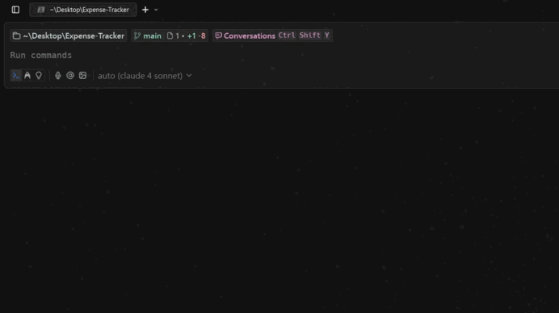
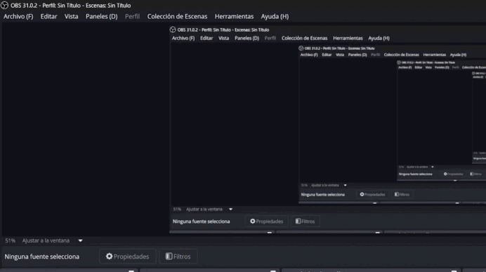

# Expense-Tracker

Build a simple expense tracker application to manage your finances. The application should allow users to add, delete, and view their expenses. The application should also provide a summary of the expenses.

# How to use

This is a simple command-line expense tracker built with Node.js and the Commander library. It stores expenses in a local JSON file (`data.json`). You can add new expenses with a description and amount, list all expenses, delete or update expenses by their ID, and view a summary of total expenses overall or for a specific month. The program validates inputs and handles file errors to ensure data integrity. It runs via CLI commands like `add`, `list`, `delete`, `update`, and `summary`.
Claro, aquí tienes el texto actualizado para usar el comando **`expense-tracker`** en vez de `node index.js`:

You use this expense tracker through command-line commands by running the `expense-tracker` command followed by one of these subcommands:

* `expense-tracker add --description "<text>" --amount <number>`: Adds a new expense with a description and amount.
* `expense-tracker list`: Shows all recorded expenses.
* `expense-tracker delete --id <number>`: Deletes the expense with the specified ID.
* `expense-tracker update --id <number> [--description "<text>"] [--amount <number>]`: Updates the description and/or amount of an expense by ID.
* `expense-tracker summary [--month <1-12>]`: Shows the total expenses overall or for a specific month.

Make sure to provide valid inputs (e.g., positive numbers for amount, non-empty descriptions, and valid IDs). Run these commands in your terminal where the `expense-tracker` command is available.

Example:

expense-tracker add --description "Lunch" --amount 12.5
expense-tracker list
expense-tracker summary --month 8

